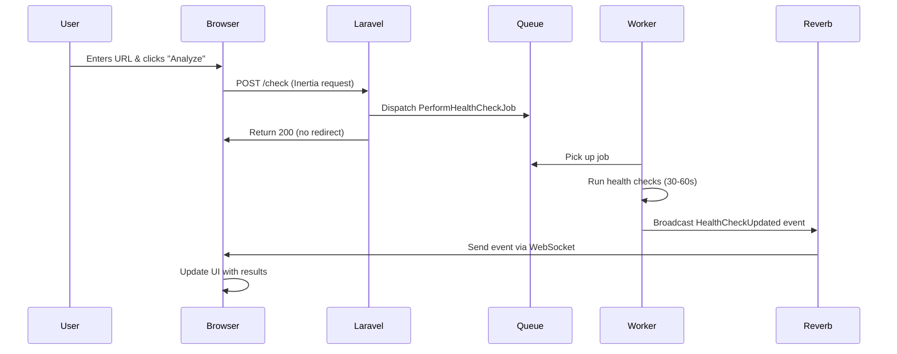

# Website Health Monitor - Technical Documentation

## Table of Contents
1. [Architecture Overview](#architecture-overview)
2. [Request Flow](#request-flow)
3. [Component Breakdown](#component-breakdown)
4. [Data Flow](#data-flow)
5. [Real-Time Communication](#real-time-communication)
6. [Security Features](#security-features)
7. [Performance Optimizations](#performance-optimizations)

---

## Architecture Overview

The Website Health Monitor is a full-stack Laravel application that analyzes websites for HTTP status, SSL certificates, DNS resolution, security headers, performance metrics (via Google Lighthouse), and broken links.

### Technology Stack

**Backend:**
- **Laravel 12** - PHP framework
- **Redis** - Queue management, caching, and session storage
- **Laravel Reverb** - WebSocket server for real-time updates
- **Guzzle** - HTTP client for making requests
- **Spatie SSL Certificate** - SSL validation
- **DomPDF** - PDF report generation

**Frontend:**
- **Vue 3** - Reactive UI framework
- **Inertia.js** - SPA without API (server-side routing)
- **Tailwind CSS 4** - Utility-first CSS
- **Laravel Echo + Pusher JS** - WebSocket client

**External APIs:**
- **Google PageSpeed Insights API** - Lighthouse metrics

---

## Request Flow

### 1. User Submits URL



### Step-by-Step Breakdown

#### **Step 1: Form Submission** ([Home.vue](file:///var/www/html/website-health-monitor/resources/js/Pages/Home.vue#L82-L95))

```javascript
const submit = () => {
    analyzing.value = true;
    results.value = null;
    
    form.post('/check', {
        preserveState: true,  // Keep component state
        preserveScroll: true, // Don't scroll to top
    });
};
```

- User enters URL and clicks "Analyze Website"
- Vue component sets `analyzing = true` to show loading animation
- Inertia.js sends POST request to `/check` endpoint

#### **Step 2: Controller Receives Request** ([HealthMonitorController.php](file:///var/www/html/website-health-monitor/app/Http/Controllers/HealthMonitorController.php#L18-L38))

```php
public function check(Request $request)
{
    // Validate URL
    $validated = $request->validate([
        'url' => 'required|url',
        'realTime' => 'boolean',
    ]);

    // Dispatch job to queue
    PerformHealthCheckJob::dispatch(
        $validated['url'],
        session()->getId(),
        $validated['realTime'] ?? false
    );

    return back(); // Return to same page (Inertia handles this)
}
```

**Key Points:**
- Validates URL format
- Gets session ID (used for WebSocket channel)
- Dispatches job to Redis queue (non-blocking)
- Returns immediately (doesn't wait for job to complete)

#### **Step 3: Queue Worker Processes Job** ([PerformHealthCheckJob.php](file:///var/www/html/website-health-monitor/app/Jobs/PerformHealthCheckJob.php))

```php
public function handle(HealthCheckService $service): void
{
    // Perform all health checks (30-60 seconds)
    $results = $service->performChecks($this->url, $this->sessionId);
    
    // Broadcast results via WebSocket
    broadcast(new HealthCheckUpdated($results, $urlHash));
    
    // Schedule next check if real-time monitoring enabled
    if ($this->realTime) {
        PerformHealthCheckJob::dispatch(...)
            ->delay(now()->addMinutes(5));
    }
}
```

**What Happens:**
1. Worker picks up job from Redis queue
2. Calls `HealthCheckService::performChecks()`
3. Broadcasts results to WebSocket channel
4. If real-time monitoring enabled, schedules next check in 5 minutes

---

## Component Breakdown

### Backend Components

#### **1. HealthCheckService** ([HealthCheckService.php](file:///var/www/html/website-health-monitor/app/Services/HealthCheckService.php))

The core service that performs all health checks. Let's break down each check:

##### **A. HTTP Status Check**

```php
$startTime = microtime(true);
$response = $this->client->get($url, [
    'timeout' => 30,
    'allow_redirects' => true,
    'verify' => false, // Don't fail on SSL errors
]);
$responseTime = round((microtime(true) - $startTime) * 1000, 2);

$results['status'] = $response->getStatusCode();
$results['responseTime'] = $responseTime;
$results['headers'] = $response->getHeaders();
```

**Purpose:** Measure HTTP response time and status code
**Timeout:** 30 seconds
**Metrics:** Status code (200, 404, etc.), response time in milliseconds

##### **B. SSL Certificate Check**

```php
if ($parsed['scheme'] === 'https') {
    try {
        $certificate = SslCertificate::createForHostName($parsed['host']);
        $results['sslValid'] = $certificate->isValid();
        $results['issuer'] = $certificate->getIssuer();
        $results['expiration'] = $certificate->expirationDate()->format('D M d Y H:i:s');
    } catch (\Exception $e) {
        $results['sslValid'] = false;
        $results['sslError'] = $e->getMessage();
    }
}
```

**Purpose:** Validate SSL certificate
**Checks:**
- Certificate validity
- Issuer information
- Expiration date
**Error Handling:** Catches SSL errors and flags them

##### **C. DNS Resolution**

```php
$dnsStart = microtime(true);
$dnsRecords = dns_get_record($parsed['host'], DNS_A + DNS_AAAA);
$dnsTime = round((microtime(true) - $dnsStart) * 1000, 2);

$results['dnsTime'] = $dnsTime;
$results['dnsRecords'] = $dnsRecords;
$results['dnsSlow'] = $dnsTime > 100; // Flag if >100ms
```

**Purpose:** Measure DNS resolution time
**Metrics:**
- Resolution time in milliseconds
- DNS records (A and AAAA)
- Slow flag if >100ms

##### **D. Security Headers Analysis**

```php
private function analyzeSecurityHeaders(array $headers): array
{
    $securityHeaders = [
        'Content-Security-Policy' => [
            'present' => isset($headers['Content-Security-Policy']),
            'recommendation' => 'Add CSP header to prevent XSS...',
        ],
        'X-Frame-Options' => [...],
        'Strict-Transport-Security' => [...],
        // ... more headers
    ];
    
    return $securityHeaders;
}
```

**Checks 6 Security Headers:**
1. **Content-Security-Policy** - XSS protection
2. **X-Frame-Options** - Clickjacking protection
3. **Strict-Transport-Security** - HTTPS enforcement
4. **X-Content-Type-Options** - MIME sniffing protection
5. **Referrer-Policy** - Referrer control
6. **Permissions-Policy** - Browser feature permissions

##### **E. Google Lighthouse Integration**

```php
$lighthouseUrl = "https://www.googleapis.com/pagespeedonline/v5/runPagespeed";
$response = $this->client->get($lighthouseUrl, [
    'query' => [
        'url' => $url,
        'key' => config('services.pagespeed.api_key'),
        'category' => ['performance', 'accessibility', 'best-practices', 'seo'],
    ],
    'timeout' => 60, // Lighthouse takes time
]);

$data = json_decode($response->getBody(), true);
$lighthouse = $data['lighthouseResult'];

// Extract scores
$results['performanceScore'] = $lighthouse['categories']['performance']['score'] * 100;
$results['accessibilityScore'] = $lighthouse['categories']['accessibility']['score'] * 100;
// ... more scores
```

**Purpose:** Get comprehensive performance metrics
**API:** Google PageSpeed Insights API v5
**Timeout:** 60 seconds (Lighthouse is slow)
**Metrics:**
- Performance Score (0-100)
- Accessibility Score (0-100)
- Best Practices Score (0-100)
- SEO Score (0-100)
- Core Web Vitals (LCP, FCP, CLS, TTI, TBT)

##### **F. Core Web Vitals Extraction**

```php
$audits = $lighthouse['audits'];

$results['metrics'] = [
    'lcp' => $audits['largest-contentful-paint']['numericValue'] ?? null,
    'fid' => $audits['max-potential-fid']['numericValue'] ?? null,
    'cls' => $audits['cumulative-layout-shift']['numericValue'] ?? null,
    'fcp' => $audits['first-contentful-paint']['numericValue'] ?? null,
    'tti' => $audits['interactive']['numericValue'] ?? null,
    'tbt' => $audits['total-blocking-time']['numericValue'] ?? null,
];
```

**Core Web Vitals:**
- **LCP** (Largest Contentful Paint) - Loading performance
- **FID** (First Input Delay) - Interactivity
- **CLS** (Cumulative Layout Shift) - Visual stability
- **FCP** (First Contentful Paint) - Initial render
- **TTI** (Time to Interactive) - Full interactivity
- **TBT** (Total Blocking Time) - Main thread blocking

##### **G. Broken Links Scanner**

```php
private function scanBrokenLinks(string $url, string $html): array
{
    $dom = new \DOMDocument();
    @$dom->loadHTML($html);
    $links = $dom->getElementsByTagName('a');
    
    $brokenLinks = [];
    $checked = 0;
    
    foreach ($links as $link) {
        if ($checked >= 50) break; // Limit to 50 links
        
        $href = $link->getAttribute('href');
        $absoluteUrl = $this->makeAbsoluteUrl($href, $url);
        
        try {
            $response = $this->client->head($absoluteUrl, ['timeout' => 5]);
            $status = $response->getStatusCode();
            
            if ($status >= 400) {
                $brokenLinks[] = ['url' => $absoluteUrl, 'status' => $status];
            }
        } catch (\Exception $e) {
            $brokenLinks[] = ['url' => $absoluteUrl, 'error' => $e->getMessage()];
        }
        
        $checked++;
    }
    
    return array_slice($brokenLinks, 0, 20); // Return max 20
}
```

**Purpose:** Find broken links on homepage
**Process:**
1. Parse HTML with DOMDocument
2. Extract all `<a>` tags
3. Check up to 50 links (performance limit)
4. Use HEAD request (faster than GET)
5. Flag 4xx and 5xx status codes
6. Return top 20 broken links

##### **H. Caching & Storage**

```php
// Store results in cache for 1 hour
$urlHash = md5($url);
Cache::put("health_check_{$urlHash}", $results, now()->addHour());

// Store in recent checks (session-specific)
$recentKey = "{$sessionId}_recent";
$recent = Cache::get($recentKey, []);
array_unshift($recent, [
    'url' => $url,
    'status' => $results['status'],
    'timestamp' => now()->format('Y-m-d H:i:s'),
    'hash' => $urlHash,
]);
$recent = array_slice($recent, 0, 10); // Keep last 10
Cache::put($recentKey, $recent, now()->addHour());
```

**Caching Strategy:**
- Results cached for 1 hour (keyed by URL hash)
- Recent checks stored per session (last 10)
- No database storage (transient data)

##### **I. SSRF Protection**

```php
private function isLocalIp(string $host): bool
{
    $ip = gethostbyname($host);
    
    // Block localhost
    if ($ip === '127.0.0.1' || $ip === '::1') return true;
    
    // Block private IP ranges
    if (filter_var($ip, FILTER_VALIDATE_IP, FILTER_FLAG_NO_PRIV_RANGE) === false) {
        return true;
    }
    
    return false;
}
```

**Security:** Prevents Server-Side Request Forgery (SSRF) attacks
**Blocks:**
- Localhost (127.0.0.1, ::1)
- Private IP ranges (10.x.x.x, 192.168.x.x, 172.16-31.x.x)
- Reserved IP ranges

---

### Frontend Components

#### **1. Home.vue** - Main UI Component

##### **State Management**

```javascript
const results = ref(null);        // Health check results
const resultsHash = ref(null);    // URL hash for PDF download
const analyzing = ref(false);     // Loading state
const loadingMessage = ref('');   // Current loading message
```

##### **Loading Animation System**

```javascript
const loadingMessages = [
    'Initializing health check...',
    'Analyzing HTTP response...',
    'Checking SSL certificate...',
    'Resolving DNS records...',
    'Scanning security headers...',
    'Running Lighthouse audit...',
    'Measuring Core Web Vitals...',
    'Checking for broken links...',
    'Compiling results...',
];

// Cycle through messages every 3 seconds
messageInterval = setInterval(() => {
    messageIndex = (messageIndex + 1) % loadingMessages.length;
    loadingMessage.value = loadingMessages[messageIndex];
}, 3000);
```

**Purpose:** Keep users engaged during long wait times
**Behavior:** Rotates through 9 different messages every 3 seconds

##### **WebSocket Integration**

```javascript
onMounted(() => {
    if (props.sessionId && window.Echo) {
        window.Echo.channel(`health-check.${props.sessionId}`)
            .listen('HealthCheckUpdated', (e) => {
                results.value = e.results;
                resultsHash.value = e.urlHash;
                analyzing.value = false;
                clearInterval(messageInterval);
            })
            .error((error) => {
                console.error('Echo error:', error);
                analyzing.value = false;
            });
    }
});
```

**Channel:** `health-check.{sessionId}` (unique per user session)
**Event:** `HealthCheckUpdated`
**Payload:** Full results object + URL hash

##### **Child Components (Using h() Render Function)**

All child components use Vue 3's `h()` render function instead of templates to work with the runtime-only build:

```javascript
const MetricCard = {
    props: ['title', 'status', 'icon', 'delay'],
    setup(props, { slots }) {
        return () => h('div', {
            class: ['bg-white/80 ...', { /* conditional classes */ }],
            style: props.delay ? `animation-delay: ${props.delay}ms` : ''
        }, [
            h('h4', { class: '...' }, props.title),
            slots.default()
        ]);
    }
};
```

**Components:**
- `MetricCard` - Colored card with status indicator
- `ScoreCircle` - Animated circular progress (Lighthouse scores)
- `MetricBadge` - Gradient badge for Core Web Vitals
- `SecurityHeader` - Pass/fail indicator for security headers

---

## Data Flow

### Complete Data Flow Diagram

```
User Input (URL)
    ↓
[Controller] Validate & Dispatch Job
    ↓
[Redis Queue] Store job
    ↓
[Queue Worker] Pick up job
    ↓
[HealthCheckService] Perform checks:
    ├─ HTTP Request (Guzzle)
    ├─ SSL Check (Spatie)
    ├─ DNS Resolution (PHP native)
    ├─ Security Headers Analysis
    ├─ Lighthouse API Call (Google)
    └─ Broken Links Scan
    ↓
[Cache] Store results (1 hour TTL)
    ↓
[Broadcasting] Send to Reverb
    ↓
[Reverb WebSocket Server] Push to client
    ↓
[Laravel Echo] Receive event
    ↓
[Vue Component] Update UI
```

---

## Real-Time Communication

### Laravel Reverb Setup

**Configuration** ([.env](file:///var/www/html/website-health-monitor/.env#L69-L79)):
```env
REVERB_APP_ID=450369
REVERB_APP_KEY=j8tyxxzybuiz9agmpkto
REVERB_APP_SECRET=edmhkgpjvhklyg3wgxmj
REVERB_HOST=localhost
REVERB_PORT=8080
REVERB_SCHEME=http
```

**Starting Reverb:**
```bash
php artisan reverb:start
```

### Broadcasting Event

**Event Class** ([HealthCheckUpdated.php](file:///var/www/html/website-health-monitor/app/Events/HealthCheckUpdated.php)):
```php
class HealthCheckUpdated implements ShouldBroadcast
{
    public function __construct(
        public array $results,
        public string $urlHash
    ) {}

    public function broadcastOn(): Channel
    {
        return new Channel('health-check.' . $this->results['sessionId']);
    }
}
```

**Broadcasting:**
```php
broadcast(new HealthCheckUpdated($results, $urlHash));
```

### Client-Side WebSocket

**Bootstrap** ([bootstrap.js](file:///var/www/html/website-health-monitor/resources/js/bootstrap.js)):
```javascript
window.Echo = new Echo({
    broadcaster: 'reverb',
    key: import.meta.env.VITE_REVERB_APP_KEY,
    wsHost: import.meta.env.VITE_REVERB_HOST,
    wsPort: import.meta.env.VITE_REVERB_PORT,
    forceTLS: false,
    enabledTransports: ['ws', 'wss'],
});
```

---

## Security Features

### 1. Rate Limiting

**Middleware** ([web.php](file:///var/www/html/website-health-monitor/routes/web.php#L6-L10)):
```php
Route::post('/check', [HealthMonitorController::class, 'check'])
    ->middleware('throttle:5,1'); // 5 requests per minute per IP
```

**Purpose:** Prevent abuse and DoS attacks
**Limit:** 5 requests per minute per IP address

### 2. SSRF Protection

```php
if ($this->isLocalIp($host)) {
    throw new \Exception('Local or private IPs not allowed');
}
```

**Blocks:**
- Internal network access
- Cloud metadata endpoints
- Private IP ranges

### 3. Input Validation

```php
$validated = $request->validate([
    'url' => 'required|url',
    'realTime' => 'boolean',
]);
```

**Validates:**
- URL format (must be valid HTTP/HTTPS)
- Boolean type for realTime flag

### 4. No Persistent Storage

- Results stored in Redis cache (1 hour TTL)
- No database storage
- Automatic cleanup after expiration

---

## Performance Optimizations

### 1. Asynchronous Processing

**Queue System:**
- Jobs dispatched to Redis queue
- Non-blocking controller response
- Background processing via workers

### 2. Caching Strategy

```php
// Check cache first
$cached = Cache::get("health_check_{$urlHash}");
if ($cached) {
    return $cached;
}

// Store for 1 hour
Cache::put("health_check_{$urlHash}", $results, now()->addHour());
```

**Benefits:**
- Avoid redundant checks
- Faster response for repeated URLs
- Reduced API calls to Google

### 3. Timeouts

```php
'timeout' => 30,  // HTTP requests
'timeout' => 60,  // Lighthouse API
'timeout' => 5,   // Broken links check
```

**Purpose:** Prevent hanging requests

### 4. Limits

- **Broken Links:** Check max 50, return max 20
- **Recent Checks:** Keep last 10 per session
- **Cache TTL:** 1 hour

### 5. Staggered Animations

```javascript
:style="`animation-delay: ${index * 50}ms`"
```

**Purpose:** Smooth visual experience, prevents layout thrashing

---

## PDF Report Generation

**Controller** ([HealthMonitorController.php](file:///var/www/html/website-health-monitor/app/Http/Controllers/HealthMonitorController.php#L40-L54)):
```php
public function download(string $urlHash)
{
    $results = Cache::get("health_check_{$urlHash}");
    
    if (!$results) {
        abort(404, 'Report not found or expired');
    }
    
    $pdf = Pdf::loadView('reports.health-report', ['results' => $results]);
    
    return $pdf->download("health-report-{$urlHash}.pdf");
}
```

**Template:** [health-report.blade.php](file:///var/www/html/website-health-monitor/resources/views/reports/health-report.blade.php)

**Includes:**
- HTTP Status & Response Time
- SSL Certificate Details
- DNS Resolution
- Security Headers Analysis
- Lighthouse Scores
- Core Web Vitals
- Broken Links

---

## Development Workflow

### Running the Application

```bash
# Start all services (server, queue, logs, vite)
composer run dev

# This runs:
# - php artisan serve --port=1704
# - php artisan queue:listen
# - php artisan pail (logs)
# - npm run dev (Vite)
```

### Testing

```bash
# Run all tests
php artisan test

# Run specific test suite
php artisan test --testsuite=Unit
php artisan test --testsuite=Feature
```

**Test Coverage:**
- Unit tests for `HealthCheckService`
- Feature tests for `HealthMonitorController`
- Broadcasting tests
- PDF generation tests

---

## Deployment Considerations

### 1. Queue Workers

**Supervisor Configuration:**
```ini
[program:health-monitor-worker]
command=php /path/to/artisan queue:work redis --tries=3
autostart=true
autorestart=true
```

### 2. Reverb Server

```bash
# Production
php artisan reverb:start --host=0.0.0.0 --port=8080
```

### 3. Environment Variables

**Required:**
- `PAGESPEED_API_KEY` - Google PageSpeed Insights API key
- `REVERB_*` - WebSocket server configuration
- `REDIS_*` - Redis connection details

### 4. Caching

```bash
# Clear cache
php artisan cache:clear

# Optimize
php artisan config:cache
php artisan route:cache
php artisan view:cache
```

---

## Summary

The Website Health Monitor is a sophisticated real-time application that:

1. **Accepts** user URL input via Vue/Inertia frontend
2. **Dispatches** background job to Redis queue
3. **Performs** comprehensive health checks (HTTP, SSL, DNS, Security, Performance, Links)
4. **Integrates** with Google Lighthouse API for performance metrics
5. **Broadcasts** results via WebSocket (Laravel Reverb)
6. **Updates** UI in real-time without page refresh
7. **Generates** PDF reports on demand
8. **Protects** against SSRF and rate limiting abuse
9. **Caches** results for performance
10. **Animates** beautifully to keep users engaged

The architecture is scalable, secure, and provides an excellent user experience with real-time updates and engaging animations.
